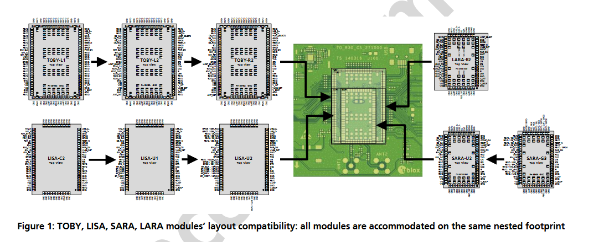

# u-blox-nested-design-evb
u-blox nested design Evaluation Board, to host several modules in order to quick hand solder and test

 

## Schematic

 

## PCB

 

## Reference

* [TOBY/LISA/SARA/LARA Nested Design Aplication Note](./extras/TOBY-LISA-SARA-LARA-NestedDesign_AppNote_(UBX-16007243).pdf)
* 

## Known Limitations

* 

## Final thoughts and improvements

* 

## Credits

Github Shields and Badges created with [Shields.io](https://github.com/badges/shields/)

Inspired by [chirp! - the plant watering alarm](https://wemakethings.net/chirp/)

ESP32 Pin definition and overview https://randomnerdtutorials.com/esp32-pinout-reference-gpios/ 